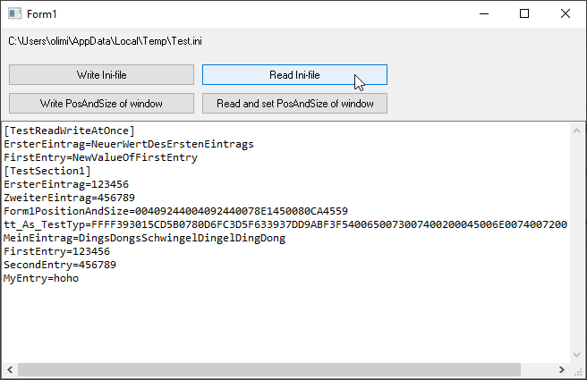

# Config_IniPrivateProfile  
## Read and write config files in ini format with PrivateProfile-api  

 
 
 
 

Project started in spring 2008  
These are 3 classes for writing and reading configuration files in the fileformats *.ini, *.vbp and *.vbg
* ConfigIniDocument 
* ConfigIniSection 
* ConfigIniKeyValue 
  
It supports Ansi, Unicode, VBC / VB6 / VBA, VBA6, VBA7 x86 and x64.  
For Unicode the file has to start either with a bom, or the first sectionname has to be in Unicode.  
Use the class ConfigIniDocument to read and write ini-files immediately.  
Or you load your settings from the ini file to ConfigIniDocument- ConfigIniSection- and ConfigIniKeyValue-objects, write your configuration values in memory and save it to disk later.  
The class ConfigIniDocument also supports a first nameless root-section, like we have in visual basic 6 project-files (*.vbp).  
For compiling the code in this repo you need the following additional repos:  
* [Err_CorrectErrorHandling](https://github.com/OlimilO1402/Err_CorrectErrorHandling)  
* [IO_PathFileName](https://github.com/OlimilO1402/IO_PathFileName)  
* [Ptr_Pointers](https://github.com/OlimilO1402/Ptr_Pointers)  
* [Sys_Strings](https://github.com/OlimilO1402/Sys_Strings)  
* [List_GenericNLinq](https://github.com/OlimilO1402/List_GenericNLinq)  
* [Win_Dialogs](https://github.com/OlimilO1402/Win_Dialogs)  

