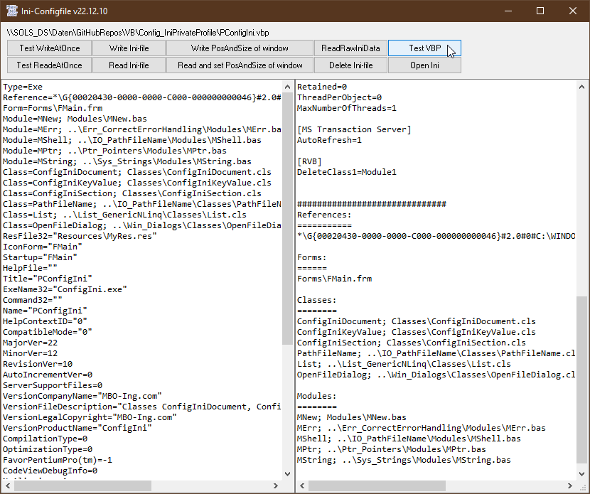

# Config_IniPrivateProfile  
## Read and write config files in ini format with PrivateProfile-api  

Project started in spring 2008  
These are 3 classes for writing and reading configuration files in the old ini-fileformat.  
* ConfigIniDocument 
* ConfigIniSection 
* ConfigIniKeyValue  
It supports Ansi, Unicode, VBC / VB6 / VBA, VBA6, VBA7 x86 and x64.  
For Unicode the file has to start either with a bom, or the first sectionname has to be in Unicode.  
Use the class ConfigIniDocument to write and read ini-files immediately.  
Or you load your settings from the ini file to ConfigIniDocument- ConfigIniSection- and ConfigIniKeyValue-objects, write your configuration values in memory and save it to disk later.  

